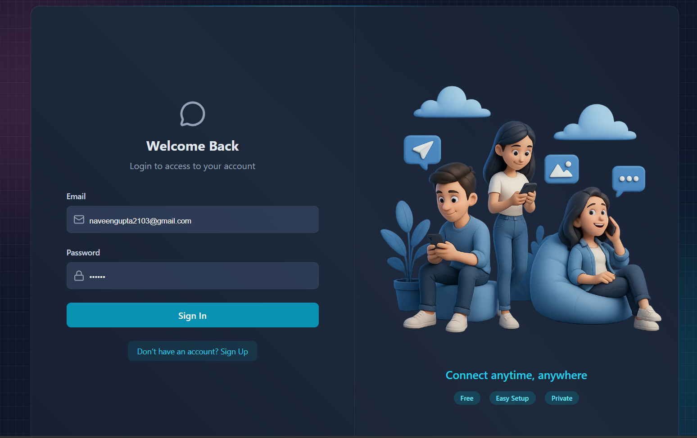
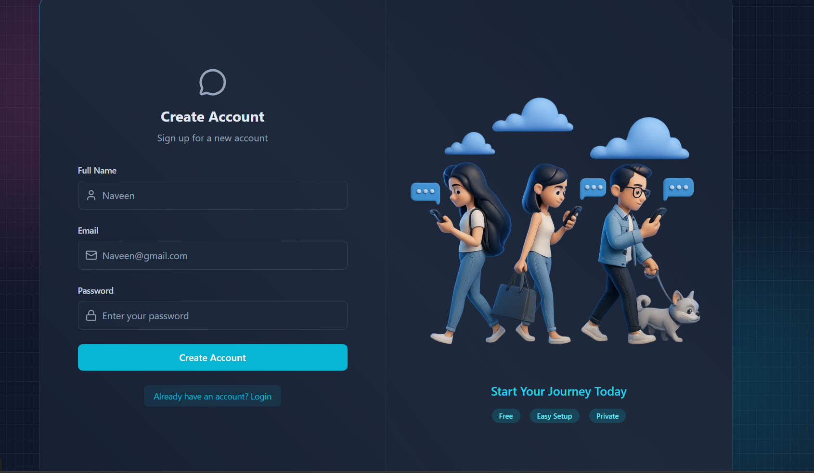
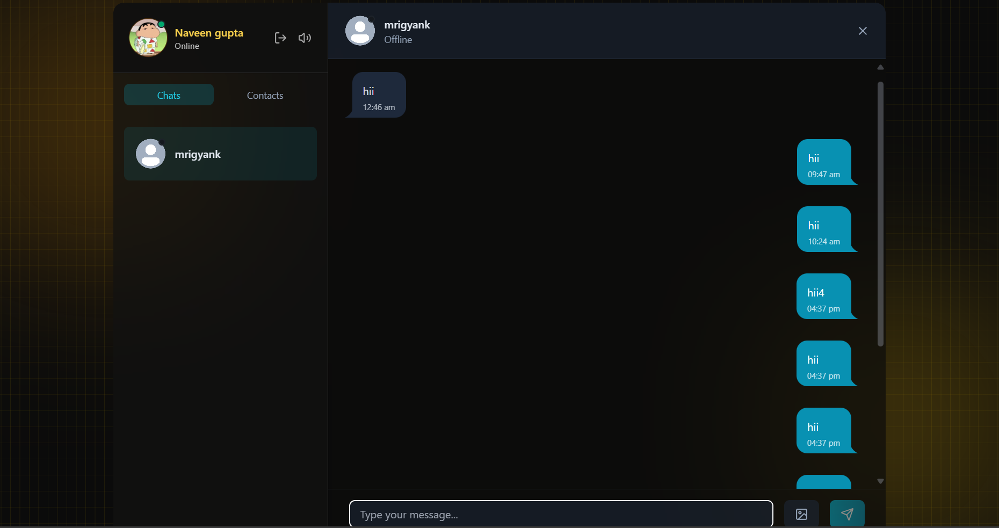

# 💬 BuzzChat

BuzzChat is a **real-time chat web application** built using the **MERN stack (MongoDB, Express.js, React, Node.js)** and **Socket.IO** for instant messaging.  
It provides a modern, fast, and private chatting experience with a clean, responsive UI.

> 🚀 Developed by **Naveen**

---

## 🌟 Features

✅ **Real-time Messaging** – Chat instantly using Socket.IO  
✅ **Secure Authentication** – JWT-based login and signup  
✅ **Media Uploads** – Share images using Cloudinary integration  
✅ **Online Status Tracking** – Know who’s active or offline  
✅ **Modern UI** – Sleek, dark, and responsive design built with TailwindCSS  
✅ **Contacts System** – Add and view chat partners easily  


---

## 🧠 Tech Stack

| Layer | Technology |
|--------|-------------|
| **Frontend** | React.js + Vite + TailwindCSS |
| **Backend** | Node.js + Express.js |
| **Database** | MongoDB + Mongoose |
| **Realtime** | Socket.IO |
| **Auth** | JWT + Cookies |
| **Media Storage** | Cloudinary |


## 🧩 Folder Structure

```
BuzzChat/
│
├── backend/
│   ├── src/
│   │   ├── controllers/
│   │   ├── models/
│   │   ├── routes/
│   │   ├── middleware/
│   │   └── server.js
│   ├── .env
│   └── package.json
│
├── frontend/
│   ├── src/
│   │   ├── components/
│   │   ├── pages/
│   │   ├── store/
│   │   └── App.jsx
│   ├── public/
│   └── package.json
│
└── README.md
```
=======
# BuzzChat

A full‑stack real‑time chat application with authentication, sockets, email, and a modern UI.

## Tech Stack
- Backend: Node.js, Express, MongoDB, Socket.IO
- Email: Resend (transactional emails)
- Media: Cloudinary
- Frontend: React + Vite, Tailwind CSS, Zustand

## Monorepo Structure
```
/ (repo root)
├─ backend/     # Express API, sockets, emails, DB
└─ frontend/    # React app (Vite)
```

## Screenshots

### Login


### Sign Up


### Chat


## Prerequisites
- Node.js LTS (v18+ recommended)
- MongoDB (Atlas or local)
- Cloudinary account (for media)
- Resend account (for emails)

## Quick Start
### 1) Clone and install
```bash
# clone
git clone <your-repo-url> BuzzChat && cd BuzzChat

# install deps for both apps
npm run install:all
```

If `install:all` is not present, run:
```bash
cd backend && npm install && cd ../frontend && npm install && cd ..
```

### 2) Environment variables
Create a `.env` file inside `backend/` with the following keys:
```env
# Server
PORT=5000
CLIENT_ORIGIN=http://localhost:5173

# Database
MONGODB_URI=mongodb://localhost:27017/buzzchat

# JWT / Auth
JWT_SECRET=replace-with-a-strong-secret
JWT_EXPIRES_IN=7d

# Email (Resend)
RESEND_API_KEY=your_resend_api_key
EMAIL_FROM=no-reply@yourdomain.com

# Cloudinary
CLOUDINARY_CLOUD_NAME=your_cloud_name
CLOUDINARY_API_KEY=your_api_key
CLOUDINARY_API_SECRET=your_api_secret
```

Optionally, add a `.env` in `frontend/` if you expose public keys (prefix with `VITE_`):
```env
VITE_API_BASE_URL=http://localhost:5000/api
```

### 3) Run in development
Open two terminals (or use `concurrently` via the root script if present):
```bash
# Terminal A - backend
cd backend && npm run dev

# Terminal B - frontend
cd frontend && npm run dev
```
Frontend runs on `http://localhost:5173`, backend on `http://localhost:5000` by default.

## Scripts
Common scripts you may find in package.json files:

Backend (`backend/package.json`):
- dev: Start API with Nodemon
- start: Start API (production)
- lint: Lint source

Frontend (`frontend/package.json`):
- dev: Vite dev server
- build: Production build
- preview: Preview production build locally
- lint: Lint source

Optional root scripts (if added):
- install:all: Install backend and frontend deps
- dev:all: Run backend and frontend concurrently

## Project Conventions
- Code style: Prettier/Tailwind formatting, meaningful names, small components
- Commits: Conventional, e.g. feat:, fix:, docs:, refactor:
- Branches: feat/<name>, fix/<issue>, chore/<task>

## Git Usage (cheatsheet)
```bash
# create a new branch
git checkout -b feat/awesome-change

# stage and commit
git add .
git commit -m "feat: add awesome change"

# push and open a PR
git push -u origin feat/awesome-change
```

## Build & Deploy
### Backend
1. Set environment variables on your server (see `.env` example)
2. Install and start
```bash
cd backend
npm ci
npm run start
```

### Frontend
```bash
cd frontend
npm ci
npm run build
# Deploy the contents of frontend/dist to your static host
```

## Troubleshooting
- CORS errors: Ensure CLIENT_ORIGIN matches the frontend URL
- Socket connection issues: Confirm backend port and path, and that auth middleware accepts the client token
- Emails not sending: Verify RESEND_API_KEY and sending domain settings

